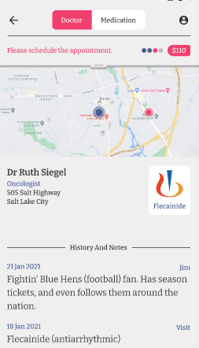
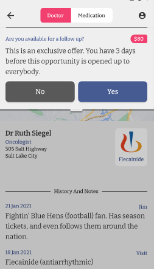
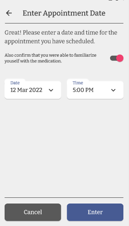
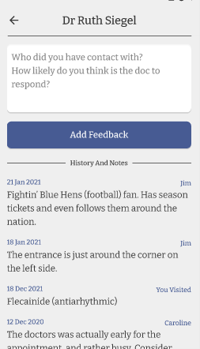
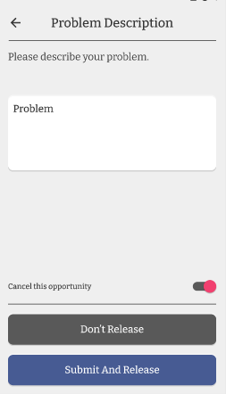
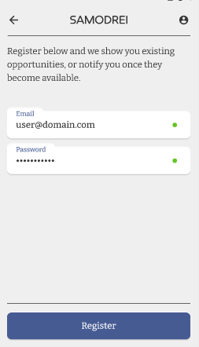
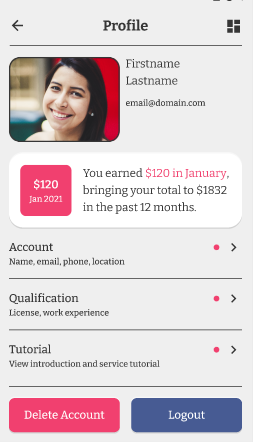

# Sarfez
A mobile app that lets medical representatives/nurses book appointments with doctors for sales of medicines of respective companies. The app also provides a shared feedback screen where nurses can share their own experiences with particular doctors.
<table>
  <tr>
    <td>Finding Opportunity</td>
     <td>Appointment Instruction</td>
     <td>Schedule Appointment</td>
  </tr>
  <tr>
    <td></td>
    <td></td>
    <td></td>
  </tr>
 </table>
 <table>
  <tr>
    <td>Provide & Read Feedbacks</td>
     <td>Report A Problem</td>
     
  </tr>
  <tr>
    <td></td>
    <td></td>
    
  </tr>
 </table>
 <table>
  <tr>
    <td>Register</td>
     <td>Profile</td>
     
  </tr>
  <tr>
    <td></td>
    <td></td>
    
  </tr>
 </table>
